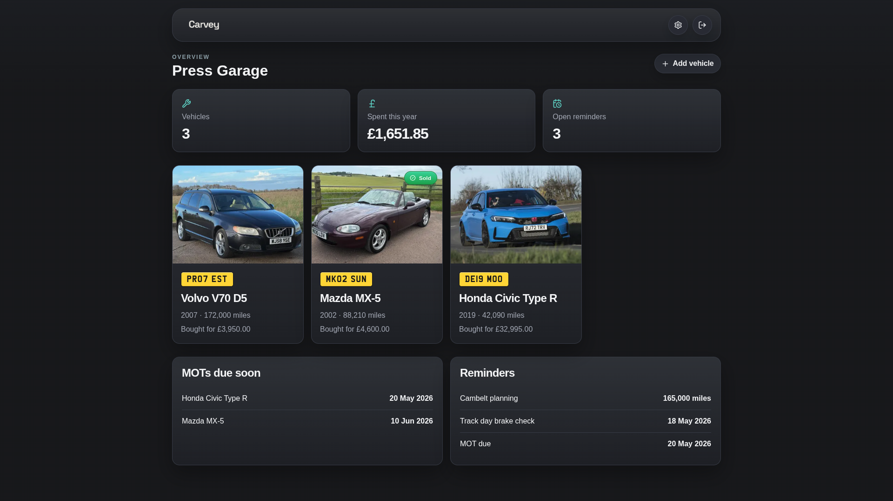

<p align="center">
  
</p>

Carvey is a self-hosted, local-first car maintenance tracker for managing vehicles, repairs, maintenance, MOTs, reminders and running costs. Your "digital service history" for your older cars, or your digital backup of all that paperwork you've got stuffed in a slippery fish.

## Screenshots



## What It Does

- Tracks multiple vehicles in one garage
- Stores vehicle details, mileage and notes
- Logs maintenance, repairs, MOTs, and reminders
- Shows a dashboard with costs, reminders, and MOTs due soon
- Backup & restore your config / data.

## How It Works

- Built as a Next.js app with a server-rendered UI
- Stores data in SQLite under `/app/data`
- Saves uploaded vehicle images alongside the database
- Packages the database and uploads together for backup and restore
- Uses UK-first defaults for miles, GBP, date formatting, and MOT records

## Quick Start

Local development:

```bash
npm install
npm run dev
```

Open `http://localhost:3000`.

On first run, create your admin account in the setup screen.

Example local env:

```bash
CARVEY_DATA_DIR=./data
TZ=Europe/London
CARVEY_DEBUG_EASTER_EGGS=false
```

Docker Compose:

```bash
docker compose up -d --build
```

Then open `http://localhost:3000`.

## Tech Stack

- Next.js
- React
- TypeScript
- SQLite via `better-sqlite3`
- Sharp for image processing
- Vitest for tests
