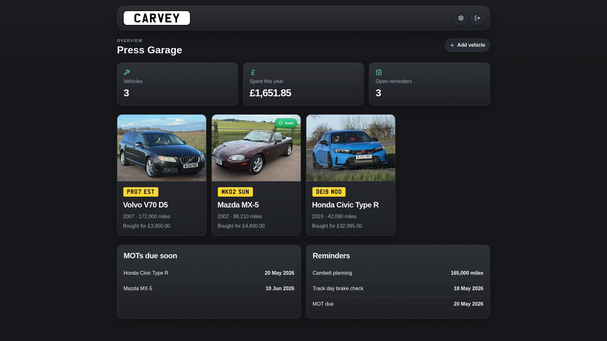

<p align="center">
  <picture>
    <source media="(prefers-color-scheme: dark)" srcset="public/icons/Carvey-plate-front.png">
    
  </picture>
</p>

Carvey is a self-hosted, local-first car maintenance tracker for managing vehicles, repairs, maintenance, MOTs, reminders and running costs. Your "digital service history" for your older cars, or your digital backup of all that paperwork you've got stuffed in a slippery fish.

## Screenshots



## What It Does

- Tracks multiple vehicles in one garage
- Stores vehicle details, odometer readings, and notes
- Logs maintenance, repairs, MOTs/emissions tests, and reminders
- Attaches receipts and documents (PDF, images) to any record
- Shows a dashboard with costs, reminders, and upcoming tests
- Configurable regional settings for currency, distance, dates, and more
- Backup & restore your config / data

## Regional Settings

Carvey is configurable for different regions under **Settings → Regional**. All options default to UK values.

| Setting | Options |
|---|---|
| Currency | GBP (£) · USD ($) · EUR (€) |
| Distance unit | Miles · Kilometres (km) |
| Date format | DD Mon YYYY · ISO 8601 (YYYY-MM-DD) |
| Plate colour | Yellow (rear) · White (front) |
| Annual vehicle test | MOT · Emissions Test · Disabled |

## How It Works

- Built as a Next.js app with a server-rendered UI
- Stores data in SQLite under `/app/data`
- Saves uploaded vehicle images and file attachments alongside the database
- Packages the database and uploads together for backup and restore
- Authentication can be disabled for deployments behind a trusted reverse proxy

## Quick Start

Local development:

```bash
npm install
npm run dev
```

Open `http://localhost:3000`.

On first run, create your admin account in the setup screen.

Example local env:

```bash
CARVEY_DATA_DIR=./data
TZ=Europe/London
```

Docker Compose:

```bash
docker compose up -d --build
```

Then open `http://localhost:3000`.

## Password Reset

If you're locked out and can't use the **Settings → Admin → Password** form, there are two ways to reset the admin password.

**Option 1 — CLI (no restart needed):**

```bash
docker exec -it <container-name> node scripts/reset-password.mjs
```

You'll be prompted to enter and confirm a new password.

**Option 2 — Environment variable (Docker Compose):**

Add `CARVEY_RESET_PASSWORD=yournewpassword` to your Docker Compose environment, restart the container, log in with the new password, then remove the variable and restart again.

## Tech Stack

- Next.js
- React
- TypeScript
- SQLite via `better-sqlite3`
- Sharp for image processing
- Vitest for tests

## Issues and Feedback
Please raise issues / bugs in the issues tab. Any feedback about features you'd like to see, raise [here](https://carvey.userjot.com/)
